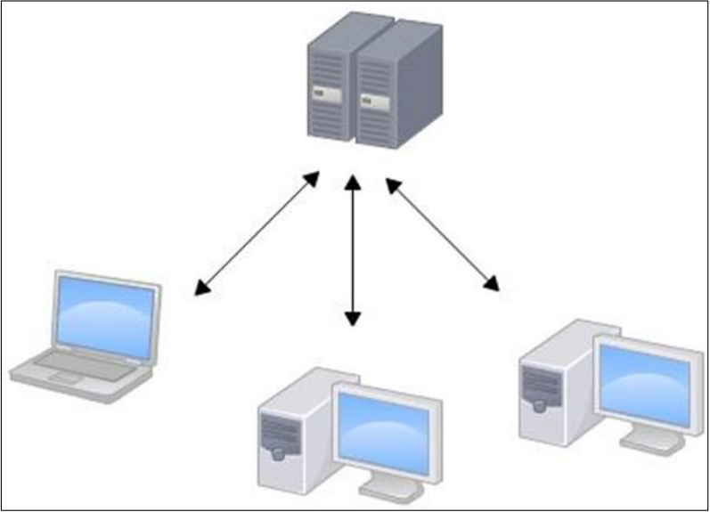
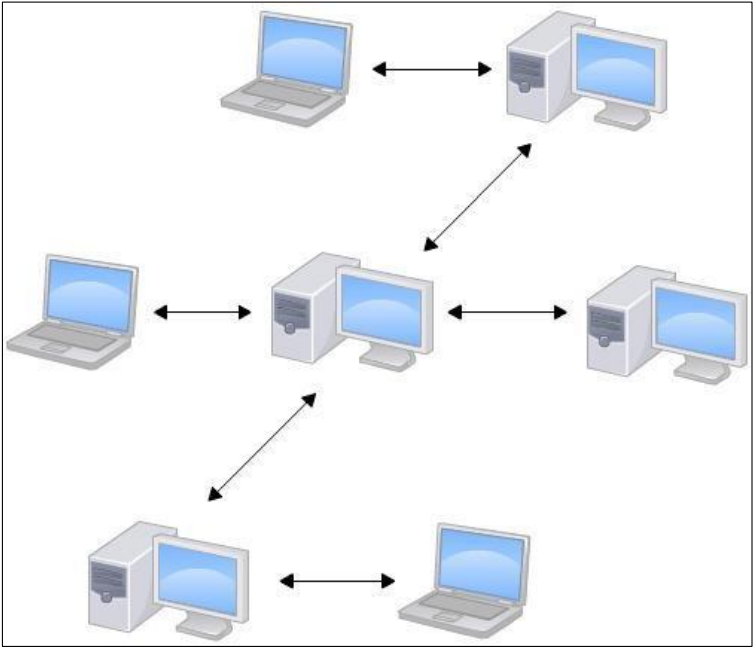
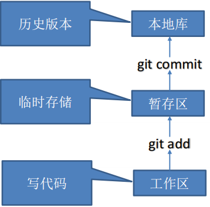

# git概述与安装

## 一、git概述

==Git是一个免费的、开源的分布式版本控制系统。==Git是Linux之父使用C语言开发用来管理Linux系统的

### 1.1 版本控制系统分类

#### a. 集中式版本控制

​		集中式版本控制系统诸如CVS,SVN等，都有一个**单一的集中管理的服务器**，保存所有文件的修订版本，而协同工作的人们都通过客户端连到这台服务器，取出最新的文件或者提交更新。

**优点**

​		这种做法带来了许多好处，每个人都可以在一定程度上看到项目中的其他人正在做些什么，而管理员可以轻松掌控每个开发者的权限，并且管理一个集中化的版本控制系统，要远比在各个客户端上维护本地数据库来得轻松容易

**缺点**

​		这么做显而易见缺点是中央服务器的单点故障，如果服务器宕机一个小时，那么在这一个小时内没谁都无法提交更新，也就无法协同工作。



#### b. 分布式版本控制

像 Git 这种分布式版本控制工具，客户端提取的不是最新版本的文件快照，而是把代码仓库完整地镜像下来（本地库）。这样任何一处协同工作用的文件发生故障，事后都可以用其他客户端的本地仓库进行恢复。因为每个客户端的每一次文件提取操作，实际上都是一次对整个文件仓库的完整备份。

分布式的版本控制系统出现之后,解决了集中式版本控制系统的缺陷:

1. 服务器断网的情况下也可以进行开发（因为版本控制是在本地进行的） 
2. 每个客户端保存的也都是整个完整的项目（包含历史记录，更加安全）



### 1.2 Git工作流程

Git整体分为三个部分：工作区、暂存区和本地库



#### a. 工作区

指人员在本地个人电脑上的区域，是人员直接修改文件的地方

#### b. 暂存区

工作区有一个隐藏目录.git，这个不算工作区，而是Git的版本库Git的版本库里存了很多东西，其中最重要的就是称为stage（或者叫index）的暂存区，还有Git为我们自动创建的第一个分支master，以及指向master的一个指针叫HEAD。

该区域存放的是使用git add命令保存所有修改并且未提交时的这一段修改数据。

#### c. 本地库

版本区可以看作是一个仓库，每次将暂存区中打包好后修改的东西送到仓库中，是各种修改的版本信息最后存储的地方。

### 1.3 Git安装

[Git官网](https://git-scm.com/)

> 注意：
>
> 1. 可以在网上查找完整的安装教程，如：
> 2. 使用`git --version` 在Bash中查看版本信息
> 3. 初次安装Git之后需要设置用户信息签名，==否则无法提交代码。==

```sh
#设置用户签名
git config --global user.name 用户名
git config --global user.email 邮箱
```

Git[的奇技淫巧](https://github.com/521xueweihan/git-tips?login=from_csdn)

